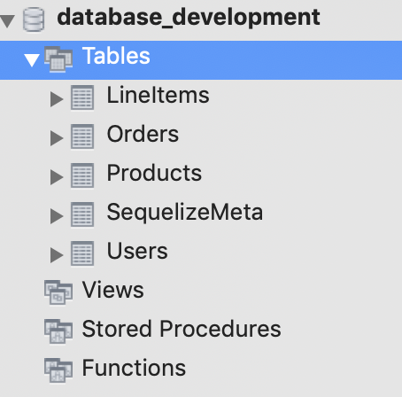

# Work In Progress...(Not yet usable)

# express-mvc-app-generator
This cli tool will generate the express app from JSON schema diagram.

### Release 1.0.0
With this cli tool you can create the full MVC express app with sequelize ORM. Simply define the schema in the JSON format and you are all set.

##### Installation
```
npm i @naveen.agarwal/express-mvc-app-generator
```

##### JSON schema sample
```javascript
{
    "tables": [
        {
            "name" : "users",
            "attributes" : [
                {
                    "name" : "username",
                    "type" : "string"
                },
                {
                    "name" : "accountNumber",
                    "type" : "bigint"
                },
                {
                    "name" : "aboutText",
                    "type" : "text"
                }
            ]
        },
        {
            "name" : "orders",
            "attributes" :[
                {
                    "name" : "userId",
                    "type" : "integer"
                },
                {
                    "name" : "name",
                    "type" : "string"
                }
            ]
        },

        {
            "name" : "line_items",
            "attributes" : [
                {
                    "name" : "orderId",
                    "type" : "integer"
                },
                {
                    "name" : "productId",
                    "type" : "integer"
                },
                {
                    "name" : "price",
                    "type" : "double"
                }
            ]
        },
        {
            "name" : "products",
            "attributes" : [
                {
                    "name" : "name",
                    "type" : "string"
                },
                {
                    "name" : "discription",
                    "type" : "text"
                }
            ]
        }

    ]
}

```

**Note** - "**type**" should be same, as it is understood by sequlelize-cli tool. For more information, refer [here](https://sequelize.org/master/manual/migrations.html).

##### Generate MVC Express Application
```
express-boot --name <you application name> --schema </full/path/to/schema.json>
```

You will see an app created with a folder name same as your application name in above command.

Run the followiung commands post app creation:

```
cd <you application name>

// Set the database name for your application in
// src/config/config.js then create database.
npx sequelize-cli db:create

// Now run the migrations to generate the tables
npx sequelize-cli db:migrate

// Run the application, default port is 3000
// Routes available at '/api/<resource>'
// Check src/app/controllers/index.js for generated resource routes
node src/index.js
```

##### In schema.json
Table names will be created as per sequelize standards. For example
``` javascript
users => Users,
line_items => LineItems,
products => Products,
orders => Orders
```

Table Names in database.

